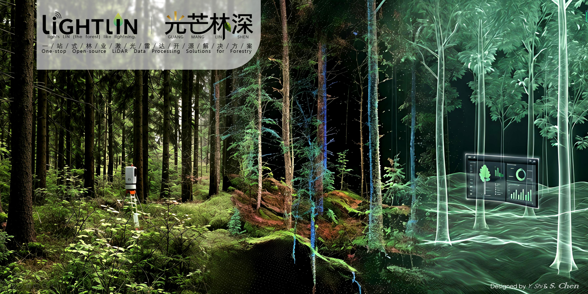

LiGHTLIN lights LIN (the forest) like lightning
===============================================

**LiGHTLIN** is a community-driven, volunteer-run project. By developing user-friendly, open-source applications for forestry LiDAR data processing, we work to lower the technical barrier and promote the proliferation of forestry information technology for both industry and research.

Check out the :doc:`usage` section for further information, including
how to :ref:`installation` the project.

.. note::

   We would be open for joining in the future, and you can continue to follow us.

Contents
--------

.. toctree::
   :maxdepth: 1
   :caption: What's news

   news

.. toctree::
   :maxdepth: 1
   :caption: Project

   smartqsm-external

.. toctree::
   :maxdepth: 1
   :caption: Documentation

   smartqsm-reference

.. toctree::
   :maxdepth: 1
   :caption: Help

   how-to-install-python-and-deep-learning-libraries