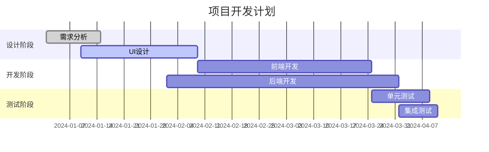

# Project LiGHTLIN

Here is the content of the markdown

```mermaid
gantt
    title 项目开发计划
    dateFormat  YYYY-MM-DD
    section 设计阶段
    需求分析      :done,    des1, 2024-01-01,2024-01-15
    UI设计       :active,  des2, 2024-01-10, 30d
    section 开发阶段
    前端开发      :         dev1, after des2, 45d
    后端开发      :         dev2, 2024-02-01, 60d
    section 测试阶段
    单元测试      :         test1, after dev1, 15d
    集成测试      :         test2, after dev2, 10d
```
