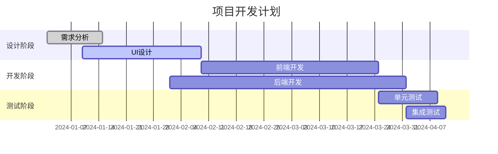

# Project CNM

[TOC]

这里是文档简介段落。支持行内强调、链接和公式等。比如爱因斯坦的质能方程 $E = mc^2$。

换行演示：  
这是同一段中的手动换行（在上一行末尾打两个空格）。

---

## 1. 标题与文本样式

### 1.1 标题层级
# H1 标题
## H2 标题
### H3 标题
#### H4 标题
##### H5 标题
###### H6 标题

### 1.2 字体与强调
- 普通文本
- 斜体：*italic* 或 _italic_
- 加粗：**bold** 或 __bold__
- 粗斜体：***bold italic***
- 删除线：~~strikethrough~~
- 下划线（HTML 扩展）：<u>underline</u>
- 高亮（部分渲染器支持）：==highlight==（如不支持则显示原文）
- 上标/下标（HTML 扩展）：X<sup>2</sup> / H<sub>2</sub>O
- 行内代码：使用 `backticks` 包裹
- 特殊字符转义：\*, \_, \`, \{ \}, \[ \], \( \), \#, \+, \-, \., \!

### 1.3 引用与嵌套引用
> 这是一级引用。
> 
> > 这是二级引用，包含一个列表：
> > - A
> > - B
> > 
> > 以及行内代码 `foo()`。

---

## 2. 列表

### 2.1 无序列表
- 项目 A
- 项目 B
  - 子项 B.1
  - 子项 B.2
    - 子子项 B.2.a

### 2.2 有序列表
1. 第一项
2. 第二项
   1. 子项 2.1
   2. 子项 2.2

### 2.3 任务列表
- [x] 已完成任务
- [ ] 待办任务
  - [ ] 子任务

---

## 3. 表格

### 3.1 基础表格与对齐
| 字段 | 描述 | 数值 |
|:---- |:---- | ---:|
| 左对齐 | 说明文字 | 123 |
| 左对齐 | 更多说明 | 4,567 |

### 3.2 宽列、内联格式、换行
| 参数 | 值 | 备注 |
| --- | --- | --- |
| `alpha` | 0.1 | 支持行内代码 |
| `beta` | 0.5 | 多行备注：<br>第一行<br>第二行 |

> 注：Markdown 不原生支持真正的单元格合并，常以 HTML 表格实现。

### 3.3 HTML 表格（合并示例）
<table>
  <thead>
    <tr><th>区域</th><th>一季度</th><th>二季度</th></tr>
  </thead>
  <tbody>
    <tr><td rowspan="2">华东</td><td>120</td><td>150</td></tr>
    <tr><td colspan="2">合计：270</td></tr>
  </tbody>
</table>

---

## 4. 链接与图片

### 4.1 链接
- 行内链接：[OpenAI](https://openai.com "OpenAI 官网")
- 引用式链接：[搜索引擎][google]
- 自动链接：<https://www.example.com>

[google]: https://www.google.com "Google"

### 4.2 图片
- 行内图片：
- HTML 控制尺寸：

---

## 5. 代码与语法高亮

### 5.1 行内代码
请调用 `doSomething(arg1, arg2)` 完成操作。

### 5.2 代码块（多语言）
```bash
# Shell
echo "Hello, world"
```

$$
x = \begin{cases}
   a &\text{if } b \\\\
   c &\text{if } d
\end{cases}
$$

```javascript
$(document).ready(function () {
    alert('RUNOOB');
});
```


